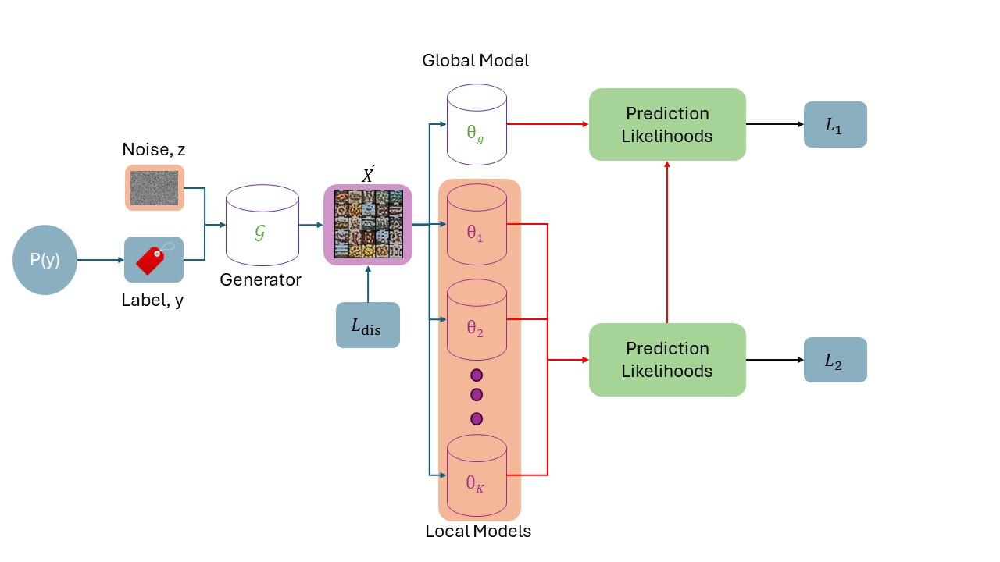

# README for FedDiff

## Overview

This repository focuses on deploying knowledge distillation federated learning with an attention diffusion-based generator model. The overall structure of the proposed method is illustrated in the figure below, applied to CIFAR-10 and CIFAR-100 classification tasks.


## Preparation

### 1. Dataset Preparation

To prepare the dataset, run the following command:

```bash
python prepare_data.py
```

In the `prepare_data.py` file, the following code line:

```python
d.make(1, 20, dir_alpha=0.05, lognorm_std=0.0, show_plots=True, seed=1024)
```

configures the dataset status. The first input parameter determines whether the dataset is IID or Non-IID. A value of `0` indicates IID, while a value of `1` indicates Non-IID.

### 2. Training

After preparing the dataset, you can run the application for training with the following command:

```bash
CUDA_VISIBLE_DEVICES=0 python ./train.py --seed 1024 --model_arch 'resnet18'  --method 'FedDiff' --dataset 'CIFAR10' --print_freq 5 --save_period 200  --n_client 100 --rule 'Dirichlet' --alpha 0.3 --sgm 0 --localE 5 --comm_amount 1000  --active_frac 0.1 --bs 50 --lr 0.1 --weight_decay 1e-3 --coef_alpha 1e-2 --lr_decay 0.998
```

### Command Explanation

- `CUDA_VISIBLE_DEVICES=0`: Specifies the GPU to use.
- `python ./train.py`: Runs the training script.
- `--seed 1024`: Sets the seed for reproducibility.
- `--model_arch 'resnet18'`: Specifies the model architecture.
- `--method 'FedDiff'`: Indicates the federated learning method.
- `--dataset 'CIFAR10'`: Specifies the dataset to use.
- `--print_freq 5`: Sets the frequency of printing training progress.
- `--save_period 200`: Sets the frequency of saving the model.
- `--n_client 100`: Specifies the number of clients.
- `--rule 'Dirichlet'`: Defines the rule for data distribution among clients.
- `--alpha 0.3`: Sets the alpha parameter for the Dirichlet distribution.
- `--sgm 0`: Specifies the standard deviation for Gaussian noise.
- `--localE 5`: Sets the number of local epochs.
- `--comm_amount 1000`: Specifies the number of communication rounds.
- `--active_frac 0.1`: Sets the fraction of active clients per round.
- `--bs 50`: Sets the batch size.
- `--lr 0.1`: Sets the learning rate.
- `--weight_decay 1e-3`: Specifies the weight decay.
- `--coef_alpha 1e-2`: Sets the coefficient for alpha.
- `--lr_decay 0.998`: Sets the learning rate decay.
